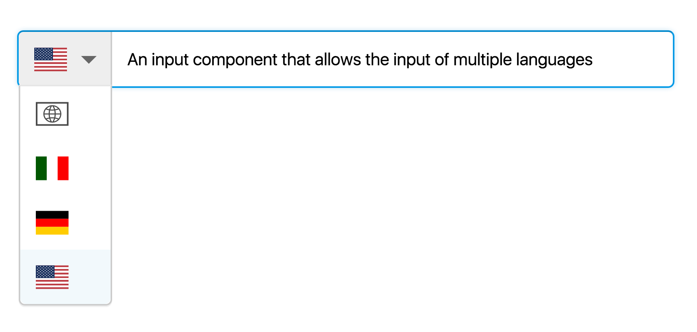

# React-translatable-input

A [ReactJS](http://facebook.github.io/react/) input component that manages multiple languages.

[](https://badge.fury.io/js/react-translatable-input)


```bash
$ npm install --save react-translatable-input
```

## Demo
**[http://belkalab.github.io/react-translatable-input/](http://belkalab.github.io/react-translatable-input)**




## Options

| Prop | Type | Description | Default |
|------|------|-------------|---------|
| **lang** | React.PropTypes.string.isRequired | The current editing language | - |
| **values** | React.PropTypes.object.isRequired | The object containing the translated strings | - |
| textarea | React.PropTypes.bool | Use a textarea for a multi-line input? | false |
| placeholder | React.PropTypes.string | The placeholder to show when the input field is empty | - |
| classes | React.PropTypes.string | Additional HTML classes to pass to the component | - |
| disabled | React.PropTypes.bool | Is the component disabled? | false |
| showLanguageName | React.PropTypes.bool | Show the language name label next to the flag? | false |
| langTranslator | React.PropTypes.func | Used to translate iso langage codes to language names  when `showLanguageName` is true | - |

#### The `values` object

The most important prop to be passed is the `values` object, which must be a plain JS Object in the form `{ langTag: langValue }`. For example:

```js
values = {
  'it': 'Italian input',
  'en-US': 'English (United States) input',
  'en': 'English input',
  'de': 'German input'
};
```

All the language tags must be [*BCP 47*](https://www.w3.org/International/articles/language-tags/index.en) compliant. Differently encoded language names will be filtered out and not shown in the component.
The only exception to this rule is the `default` language, intended to be used as a general fallback language. If the `default` language is present, it will always be put on top of the available languages.

## Callbacks

| Prop | Type | Syntax | Description |
|------|------|--------|-------------|
| onLanguageChange| React.PropTypes.func | function(selectedLanguage) {} | Callback on language selection |
| onValueChange| React.PropTypes.func | function(newValue, editingLanguage) {} | Callback on text entered |
| onKeyDown| React.PropTypes.func | function(event) {} | Callback on keydown when text input is focused |

## Build it yourself

Clone and run

```bash
$ npm install
```

## Contributors
[Giovanni Frigo](https://github.com/giovannifrigo), Developer @[Belka](https://github.com/BelkaLab)

[Matteo Bertamini](https://github.com/bertuz), Former developer @[Belka](https://github.com/BelkaLab)

## License
react-translatable-input is Copyright (c) 2016-2018 Belka srl. It is free software, and may be redistributed under the terms specified in the LICENSE file (TL;DR: MIT license).  

## About Belka


[Belka](http://belka.us/en) is a Digital Agency specialized in design, mobile applications development and custom solutions.
We love open source software! You can [see our projects](http://belka.us/en/portfolio/) or look at our case studies.

Interested? [Hire us](http://belka.us/en/contacts/) to help build your next amazing project.

[www.belka.us](http://belka.us/en)
